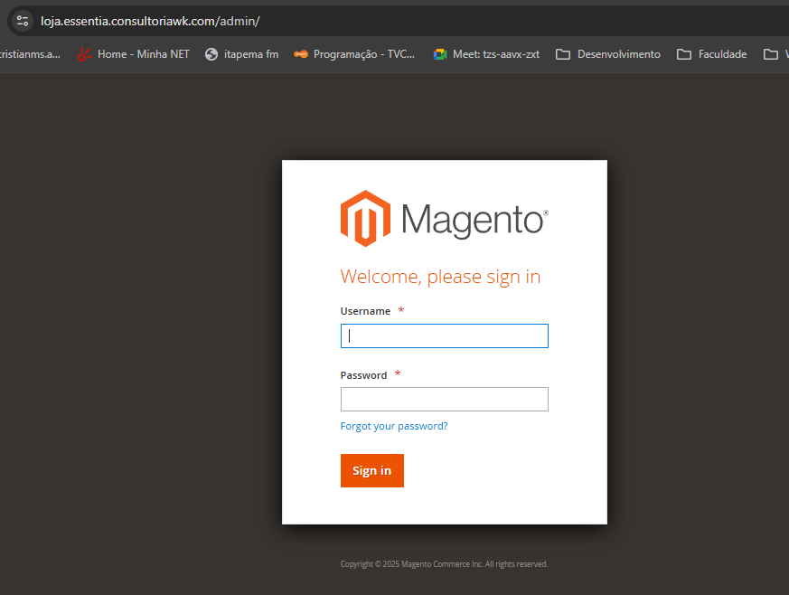
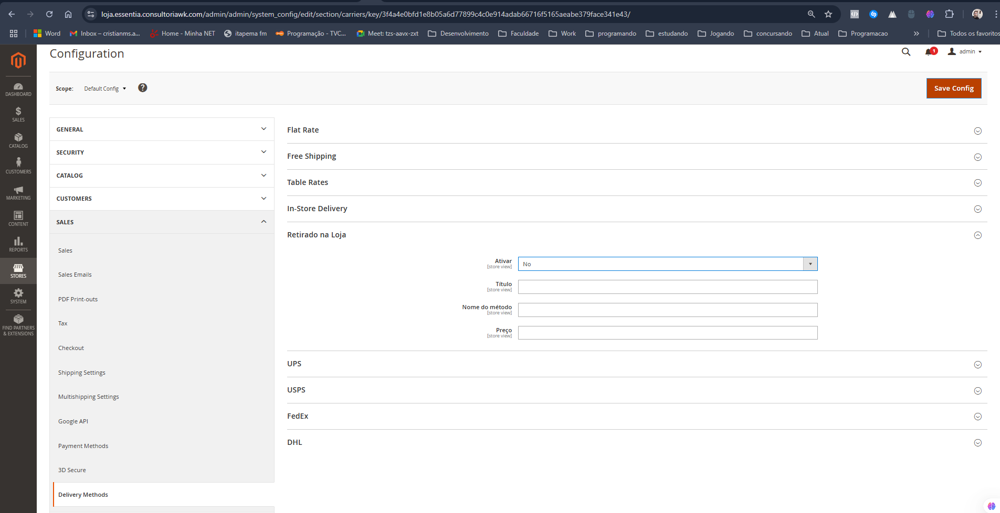

# Módulo de Entrega Personalizada - Retirado na Loja

Este módulo foi desenvolvido para Magento 2 e adiciona uma nova opção de método de entrega chamado **Retirado na Loja**, que permite ao cliente retirar seu pedido presencialmente em uma loja física cadastrada.

## ✔️ Funcionalidades

- Método de entrega com o título **"Retirado na Loja"**
- Sem cálculo de cotação de frete
- Visível no checkout para o cliente selecionar
- Visível no grid de pedidos no admin, com suporte a filtro pelo método
- Configurações administrativas disponíveis em:
  `Stores → Configuration → Sales → Delivery Methods → Retirado na Loja`

---

## 📦 Requisitos

- Magento 2.4.x (testado na versão 2.4.7)
- PHP 8.2+

---

## 🚀 Instalação

1. Clone ou copie o conteúdo deste repositório para a pasta:

   ```
   app/code/WK/RetiradaNaLoja
   ```

2. Execute os comandos no terminal dentro da raiz da instalação do Magento:

   ```bash
   bin/magento module:enable WK_RetiradaNaLoja
   bin/magento setup:upgrade
   bin/magento setup:di:compile
   bin/magento cache:flush
   ```

3. Acesse o admin:
   - Vá em `Stores → Configuration → Sales → Delivery Methods`
   - Configure o método **Retirado na Loja**

---

## 🧪 Testes

Após a instalação, no frontend:
- Adicione um produto ao carrinho
- Prossiga para o checkout
- A opção **Retirado na Loja** estará disponível na etapa de envio

No backend:
- Acesse o menu `Sales → Orders`
- O método estará visível na listagem e com filtro por nome

---

## 🧩 Estrutura do Módulo

```
WK/RetiradaNaLoja/
├── etc/
│   └── module.xml
├── registration.php
├── composer.json
└── Model/
    └── Carrier/
        └── Retiradanaloja.php
```

---

## 🔧 Configurações Técnicas

- Código do carrier: `retiradanaloja`
- Título no checkout: **"Retirado na Loja"**
- Ativo via `system.xml` com opção de habilitar/desabilitar
- `collectRates()` retorna tarifa fixa zero (frete gratuito) e sem API externa

---

## 🧠 Observações

Este módulo foi desenvolvido para fins do desafio técnico proposto pela Essentia Group. Ele segue a estrutura padrão de carriers do Magento 2 e pode ser facilmente expandido para múltiplas lojas ou pontos de retirada com ajustes mínimos.

---

## 👤 Autor

Cristian W. K.

---
- Para logar: admin
- pwd: desde3113



## 📬 Entrega

Repositório GitHub: [https://github.com/cristianawktec/Magento-RetiradaNaLoja](https://github.com/cristianawktec/Magento-RetiradaNaLoja)  
Versão Magento utilizada: **2.4.7**  
